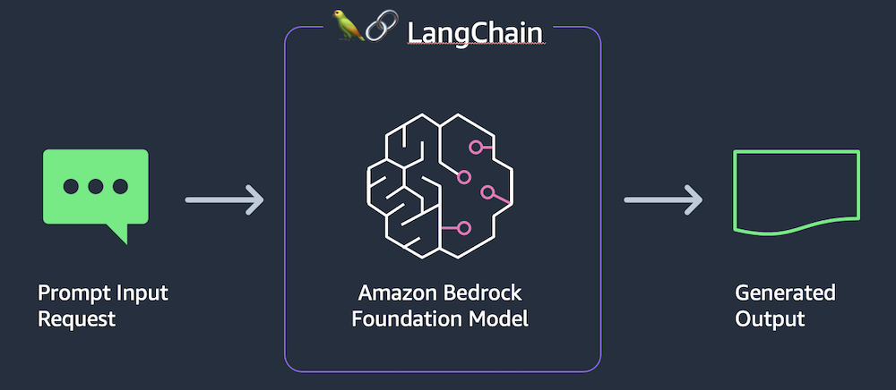

# Introduction

In this repo, I'll practice the `AWS bedrock` service to interact with different AI models, and there are several topics to practice with different folders.

You can start from the basics in the following order:

### Basic
- langchain
- params
- temperature
- streaming
- into_streaming
- embedding
- simple_streamlit
### Advanced
In advanced practices below, we will collect user input, pass it to Bedrock, and return the foundation model’s response.

- text
- image
- rag
- chatbot
- rag_chatbot
- streaming

# About Model Selection

There is currently no straightforward answer to which model is best for a given scenario. Each model will have relative strengths and weaknesses based on its training data, overall size, and training approach. You will want to gain familiarity with several models so that you can experiment with each on a case-by-case basis.

You will want to find the best model based on a cost/performance trade-off. You may find that a lower-cost model meets the needs for your use case. You could potentially mix and match models within an application for different tasks. For example, using a smaller model for sentiment analysis vs. a larger model for in-depth summarization or content creation.

The experimentation should not end with deployment to production. You may want to experiment by A/B testing two or more models to see which provides the best results. You will also want to monitor results in production to see if it's time to try new prompt templates or new models.

You can see a list of Amazon Bedrock's base model IDs in the [Amazon Bedrock User Guide](https://docs.aws.amazon.com/bedrock/latest/userguide/model-ids.html) 