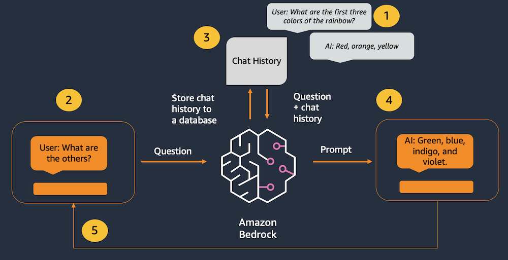

# introduction

Amazon Bedrock (and LLMs in general) don’t have any concept of state or memory. Any chat history has to be tracked externally and then passed into the model with each new message. We are using LangChain's **ConversationSummaryBufferMemory** class to track chat history. Since there is a limit on the number of tokens that can be processed by the model, we need to prune the chat history so there is enough space left to handle the user's message and the model's responses. ConversationSummaryBufferMemory supports this by tracking the most recent messages and summarizing the older messages.

**This application consists of two files: one for the Streamlit front end, and one for the supporting library to make calls to Bedrock.**

# Architecture

1. Past interactions are tracked in the chat memory object.
2. The user enters a new message.
3. The chat history is retrieved from the memory object and added before the new message.
4. The combined history & new message are sent to the model.
5. The model's response is displayed to the user.

# Run the app
Run the streamlit command from the terminal.

`streamlit run chatbot_app.py --server.port 8080`
