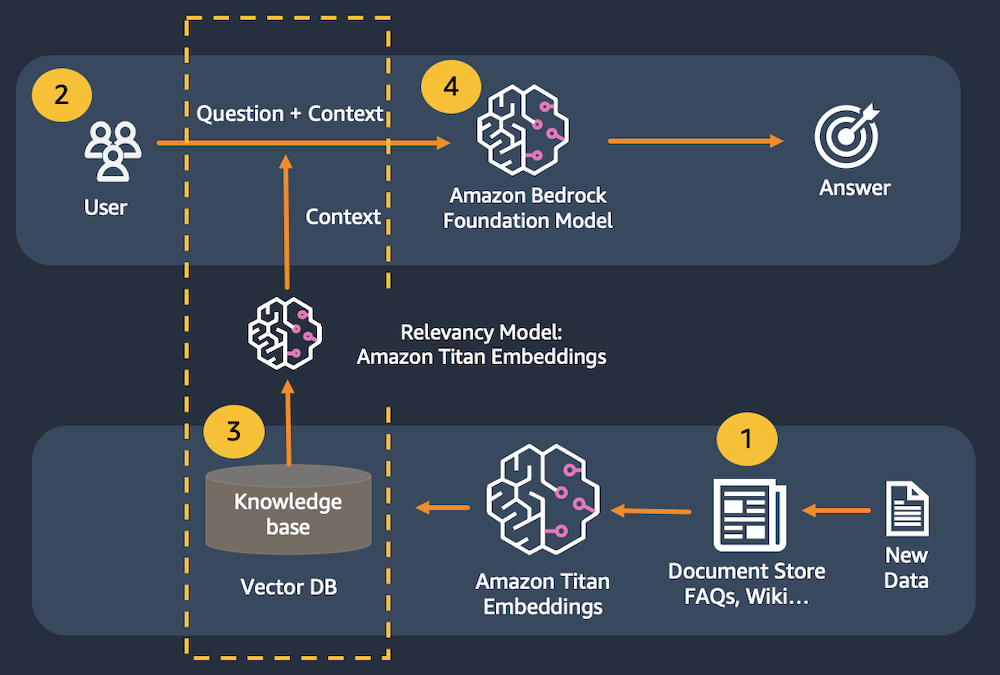

# Introduction

Large language models are prone to **hallucination**, which is just a fancy word for making up a response. To correctly and consistently answer questions, we need to ensure that the model has real information available to support its responses. We use the Retrieval-Augmented Generation (RAG) pattern to make this happen.

With Retrieval-Augmented Generation, we first pass a user's prompt to a data store. This might be in the form of a query to [Amazon Kendra](https://aws.amazon.com/kendra/) . We could also create a numerical representation of the prompt using Amazon Titan Embeddings to pass to a vector database. We then retrieve the most relevant content from the data store to support the large language model's response.

In this practice, we will use an in-memory [FAISS](https://github.com/facebookresearch/faiss)  database to demonstrate the RAG pattern. In a real-world scenario, you will most likely want to use a persistent data store like Amazon Kendra or the vector engine for [Amazon OpenSearch Serverless](https://aws.amazon.com/opensearch-service/serverless-vector-engine/) .

**This application consists of two files: one for the Streamlit front end, and one for the supporting library to make calls to Bedrock.**

# Architecture



 1. A document is broken up into chunks of text. The chunks are passed to Titan Embeddings to be converted to vectors. The vectors are then saved to the vector database.
 2. The user submits a question.
 3. The question is converted to a vector using Amazon Titan Embeddings, then matched to the closest vectors in the vector database.
 4. The combined content from the matching vectors + the original question are then passed to the large language model to get the best answer.

# About library code

- Add a function: `get_llm()` to create a Bedrock LangChain client.
- Add the function: `get_index()` to create the in-memory vector store.

# About Streamlit front-end app

- Add the vector index to the session cache.
  - This allows us to maintain an in-memory vector database per user session.
```python
if 'vector_index' not in st.session_state: #see if the vector index hasn't been created yet
    with st.spinner("Indexing document..."): #show a spinner while the code in this with block runs
        st.session_state.vector_index = glib.get_index() #retrieve the index through the supporting library and store in the app's session cache
```

# Run the app
Run the streamlit command from the terminal.

`streamlit run rag_app.py --server.port 8080`
