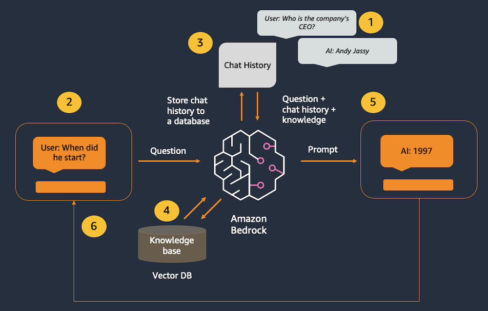

# Introduction

Amazon Bedrock (and LLMs in general) don’t have any concept of state or memory. Any chat history has to be tracked externally and then passed into the model with each new message. We are using LangChain's **ConversationBufferWindowMemory** class to track chat history. Since there is a limit on the number of tokens that can be processed by the model, we need to prune the chat history so there is enough space left to handle the user's message and the model's responses. ConversationBufferWindowMemory supports this by tracking the most recent messages.

We also want to supplement the model's underlying data with external knowledge through Retrieval-Augmented Generation (RAG). We'll use LangChain's **ConversationalRetrievalChain** class to combine chatbot and RAG functionality in a single call to LangChain.

In this practice, we will use an in-memory [FAISS](https://github.com/facebookresearch/faiss)  database to demonstrate the RAG pattern. In a real-world scenario, you will most likely want to use a persistent data store like Amazon Kendra or the vector engine for [Amazon OpenSearch Serverless](https://aws.amazon.com/opensearch-service/serverless-vector-engine/) .

**This application consists of two files: one for the Streamlit front end, and one for the supporting library to make calls to Bedrock.**

# Architecture



1. Past interactions are tracked in the chat memory object.
2. The user enters a new message.
3. The chat history is retrieved from the memory object and added before the new message.
4. The question is converted to a vector using Amazon Titan Embeddings, then matched to the closest vectors in the vector database.
5. The combined history, knowledge, and new message are sent to the model.
6. The model's response is displayed to the user.

# About library code

- Add a function: `get_llm()` to create a Bedrock LangChain client.
- Add the function: `get_index()` to create the in-memory vector store.
- Add a function: `get_memory()` to initialize a LangChain memory object.
  - In this case, we are using the ConversationBufferWindowMemory class. This allows us to track the most recent messages and summarize older messages so that the chat context is maintained over a long conversation.

# About Streamlit front-end app

- Add the LangChain memory to the session cache.
  - This allows us to maintain a unique chat memory per user session. Otherwise, the chatbot won't be able to remember past messages with the user.
  - In Streamlit, session state is tracked server-side. If the browser tab is closed, or the application is stopped, the session and its chat history will be lost. In a real-world application, you would want to track the chat history with a service like Amazon ElastiCache  or Amazon DynamoDB .
```python
if 'memory' not in st.session_state: #see if the memory hasn't been created yet
    st.session_state.memory = glib.get_memory() #initialize the memory
```
- Add the for loop to render previous chat messages.
  - Re-render previous messages based on the chat_history session state object.
```python
#Re-render the chat history (Streamlit re-runs this script, so need this to preserve previous chat messages)
for message in st.session_state.chat_history: #loop through the chat history
    with st.chat_message(message["role"]): #renders a chat line for the given role, containing everything in the with block
        st.markdown(message["text"]) #display the chat content
```


# Run the app
Run the streamlit command from the terminal.

`streamlit run rag_chatbot_app.py --server.port 8080`
